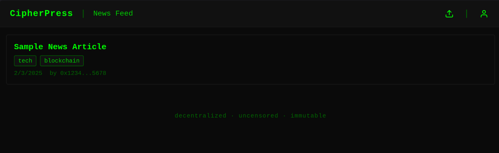

# CipherPress - Decentralized News Platform

CipherPress is a decentralized news platform that enables anonymous and censorship-resistant publishing using blockchain technology and IPFS.



## Features

- 🔐 **Decentralized Publishing**: Articles are stored on IPFS, ensuring censorship resistance
- 👤 **Anonymous Posting**: Connect with MetaMask wallet for pseudonymous publishing
- 🏷️ **Content Organization**: Tag-based article categorization
- 💻 **Terminal-Inspired UI**: Clean, minimalist interface with a cyberpunk aesthetic
- 📱 **Responsive Design**: Works seamlessly across desktop and mobile devices

## Getting Started

### Prerequisites

- Node.js (v14 or later)
- MetaMask browser extension
- Modern web browser

### Installation

1. Clone the repository:

   ```bash
   git clone https://github.com/yourusername/cipherpress.git
   cd cipherpress
   ```

2. Install dependencies:

   ```bash
   npm install
   ```

3. Start the development server:

   ```bash
   npm run dev
   ```

4. Open http://localhost:3000 in your browser

### Usage

1. **Connect Wallet**
   - Click the profile icon in the top right
   - Connect your MetaMask wallet

2. **Browse Articles**
   - View all articles on the main feed
   - Filter by tags
   - Click articles to read full content

3. **Publish Content**
   - Click the upload icon
   - Fill in title, content, and tags
   - Submit to publish to IPFS

## Contributing

We welcome contributions! Please see our [Contributing Guidelines](CONTRIBUTING.md) for details.

## Security

- All content is stored on IPFS
- No central database or server
- Wallet connections are secure through MetaMask
- No personal data collection

## License

This project is licensed under the MIT License - see the [LICENSE](LICENSE) file for details.

## Support

- Join our [Discord](https://discord.gg/cipherpress)
- Follow us on [Twitter](https://twitter.com/cipherpress)
- Report issues on [GitHub](https://github.com/yourusername/cipherpress/issues)